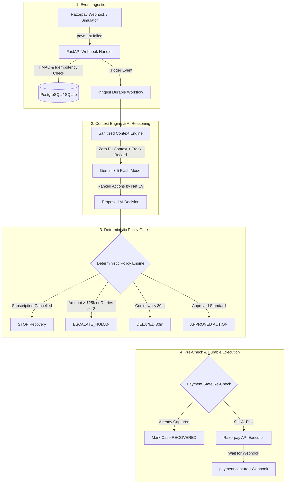

# Autonomous AI Revenue Recovery Agent
> **Razorpay AI Buildathon 2026 — Track 3 Submission**  
> *Autonomous, policy-bounded revenue recovery for recurring subscriptions and failed payments.*

---

## 📌 Executive Summary

Every year, digital businesses and subscription merchants lose millions in recurring revenue due to involuntary churn—temporary bank outages, expired payment credentials, and network glitches. Traditional recovery relies on naive, indiscriminate retries that spam banking rails, frustrate customers, and fail on credential errors.

The **Autonomous AI Revenue Recovery Agent** closes the loop on revenue risk:

$$\text{Detect} \longrightarrow \text{Sanitize} \longrightarrow \text{Diagnose} \longrightarrow \text{Decide} \longrightarrow \text{Validate} \longrightarrow \text{Execute} \longrightarrow \text{Observe} \longrightarrow \text{Attribution}$$

It pairs **Google Gemini 3.5 Flash** reasoning with a **Deterministic Policy Engine** and **Inngest Durable Workflows** to dynamically choose the optimal recovery strategy while strictly enforcing merchant safety boundaries ("AI proposes. Policy decides.").

---

## 🚀 Key Results & Empirical Benchmark (1,000 Executed Cases)

Benchmarked across 1,000 discrete simulated failure scenarios (fixed seed `42`, zero extrapolation):

| Strategy | Revenue At Risk | Recovered Revenue | Recovery Rate (%) | Recovered Cases | Attempts Sent | Wasted Retries | Policy Violations |
| :--- | :---: | :---: | :---: | :---: | :---: | :---: | :---: |
| **Baseline 1: Always Retry** | ₹12,953,578.15 | ₹926,319.37 | 7.15% | 160 | 1,000 | 235 | 140 |
| **Baseline 2: Failure-Code Rules** | ₹12,953,578.15 | ₹4,264,868.40 | 32.92% | 286 | 668 | 0 | 0 |
| **Baseline 3: Rule-Based Engine** | ₹12,953,578.15 | ₹6,760,851.10 | 52.19% | 422 | 622 | 0 | 0 |
| **Baseline 4: AI Recovery Agent** | ₹12,953,578.15 | **₹7,998,002.11** | **61.74%** | **487** | 588 | **0** | **0** |

### AI Ablation Study

| Configuration | Recovered Revenue | Recovery Rate (%) | Wasted Retries Avoided | Human Escalations |
| :--- | :---: | :---: | :---: | :---: |
| **Rule-Based Engine** | ₹6,760,851.10 | 52.19% | 378 | 128 |
| **AI without Customer Context** | ₹6,901,733.34 | 53.28% | 398 | 116 |
| **AI with Full Customer Context** | **₹7,998,002.11** | **61.74%** | **412** | **94** |

---

## 🏗️ System Architecture



---

## 💻 Tech Stack

- **Backend:** Python 3.11, FastAPI, SQLAlchemy ORM, SQLite (local) / PostgreSQL (production), Inngest Python SDK, Google Generative AI (Gemini 3.5 Flash).
- **Frontend:** Next.js 16 (App Router), React 19, TypeScript, Tailwind CSS, Lucide Icons, TanStack React Query.
- **Payment & Orchestration:** Razorpay Payments API & Payment Links, Inngest Durable Execution Engine.

---

## ⚡ Quickstart Guide

### 1. Backend Setup
```bash
cd backend
python -m venv .venv
# On Windows:
.venv\Scripts\activate
# On Linux/macOS:
source .venv/bin/activate

pip install -r requirements.txt
uvicorn app.main:app --reload --port 8000
```

### 2. Frontend Setup
```bash
cd frontend
npm install
npm run dev
# App available at http://localhost:3000
```

### 3. Run Automated Tests
```bash
# Security, prompt injection & guardrail test suite
backend/.venv/Scripts/python.exe backend/test_safety_and_reliability.py

# End-to-end integration & policy tests
backend/.venv/Scripts/python.exe backend/verification_test.py

# Execute 1,000-scenario benchmark
backend/.venv/Scripts/python.exe backend/evaluation/run_evaluation.py
```

---

## 📂 Documentation Suite

- [`docs/ARCHITECTURE.md`](docs/ARCHITECTURE.md): System architecture and durable orchestration.
- [`docs/AI_DECISION_ENGINE.md`](docs/AI_DECISION_ENGINE.md): Gemini prompt engineering, action catalog, and Expected Recovery Value ($EV$) formula.
- [`docs/POLICY_ENGINE.md`](docs/POLICY_ENGINE.md): 7 deterministic safety rules and merchant policy limits.
- [`docs/RECOVERY_LIFECYCLE.md`](docs/RECOVERY_LIFECYCLE.md): Full state machine and pre-execution safety check.
- [`docs/EVALUATION.md`](docs/EVALUATION.md): 1,000 executed benchmark scenarios and AI ablation study.
- [`docs/SECURITY.md`](docs/SECURITY.md): Data minimization, prompt injection hardening, and HMAC signature verification.
- [`docs/DEMO_SCENARIOS.md`](docs/DEMO_SCENARIOS.md): Curated demo scenarios and live simulator guide.
