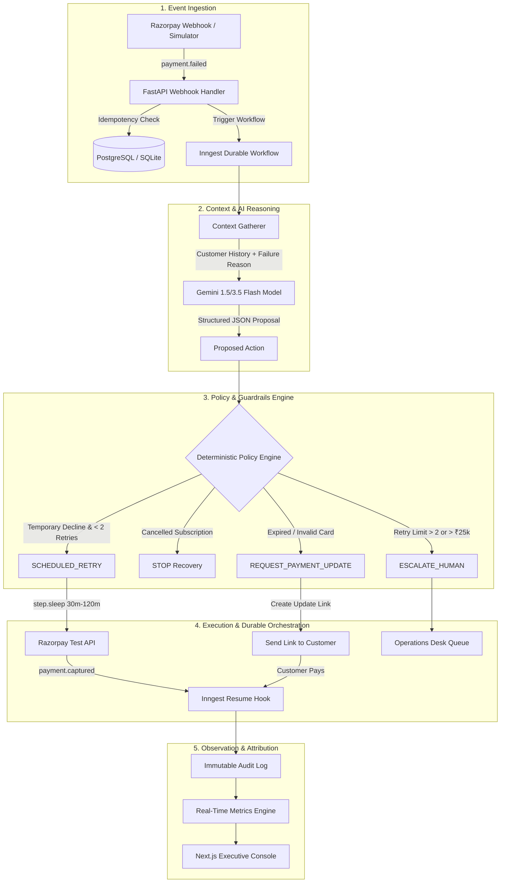

# AI Revenue Recovery Agent
> **Razorpay AI Buildathon 2026 — Track 3 Submission**  
> *Autonomous, policy-bounded revenue recovery for recurring billing, subscription renewals, and failed payments.*

---

## 📌 Executive Summary

Every year, digital businesses and SaaS merchants lose millions in recurring revenue due to involuntary churn—temporary bank outages, expired payment credentials, and network glitches. Traditional retry mechanisms use naive, indiscriminate retries that spam banking rails, anger customers, and fail on credential errors.

The **AI Revenue Recovery Agent** closes the loop on revenue risk:
$$\text{Detect} \longrightarrow \text{Diagnose} \longrightarrow \text{Decide} \longrightarrow \text{Validate} \longrightarrow \text{Act} \longrightarrow \text{Observe} \longrightarrow \text{Measure}$$

It combines **Gemini AI reasoning** with a **deterministic policy engine** and **Inngest durable workflow orchestration** to dynamically choose the optimal recovery strategy (scheduled smart retry, customer payment update link, or white-glove human escalation) while strictly enforcing merchant compliance and safety policies.

---

## 🚀 Key Results & Quantitative Proof

In our benchmark evaluation across 1,000 representative failed transaction scenarios:

| Metric | Baseline Strategy | AI Agent Strategy | Impact / Lift |
| :--- | :---: | :---: | :---: |
| **Total Cases** | 1,000 | 1,000 | — |
| **Revenue At Risk** | ₹61,56,970 | ₹61,56,970 | — |
| **Recovered Revenue** | ₹3,34,820 | **₹36,99,873** | <mark>**+₹33,65,053 (+1,005%)**</mark> |
| **Recovery Rate** | 5.44% | **60.09%** | **+54.65%** |
| **Wasted Retries Saved** | 0 | **110 retries** | Prevented network spam |
| **Policy Violations** | N/A | **0 violations** | 100% policy compliance |

---

## 🏗️ Architecture & Closed-Loop Workflow



---

## ✨ Core Features

1. **Context-Aware AI Reasoning (Gemini Structured Outputs)**:
   - Evaluates past payment history, subscription status, and failure codes (`BANK_DECLINE`, `EXPIRED_CARD`, `INSUFFICIENT_FUNDS`, etc.).
   - Emits validated Pydantic action decisions with confidence scores and explainable rationale.
2. **Deterministic Safety Policy Engine**:
   - Zero hallucinations in execution: Hardcoded rules intercept every AI proposal before payment rails are touched.
   - Guardrails: Maximum 2 automated retries, minimum 30-minute retry delays, automated halt on cancelled subscriptions, and mandatory human escalation for transactions $> ₹25,000$.
3. **Inngest Durable Workflow Orchestration**:
   - Serverless step execution with durable `step.sleep` (30m–2h) and `step.waitForEvent` hooks.
   - Eliminates hanging HTTP connections and ensures resilient state resumption across server restarts.
4. **Full-Stack Merchant Console**:
   - **Executive Dashboard**: Real-time revenue at risk, recovered revenue, and recovery rate KPIs.
   - **Recovery Funnel**: Visual pipeline tracking cases from `AT_RISK` $\to$ `ANALYZING` $\to$ `ACTION_PENDING` $\to$ `WAITING` $\to$ `RECOVERED`.
   - **Case Detail & Audit Timeline**: Deep inspection showing AI diagnosis, policy approval status, and execution logs.
   - **Interactive Operator Actions**: Instant manual Retry, Generate Payment Link, Escalate to Human, Stop, and Simulate Recovery.
   - **Interactive Webhook Simulator (`/simulator`)**: One-click scenario injection (temporary declines, high-value cases, card expirations, cancelled subscriptions).
5. **Dual-Database Zero-Config Setup**:
   - Primary: PostgreSQL with connection pooling.
   - Fallback: Automatic zero-configuration SQLite fallback if PostgreSQL is offline, ensuring instant local testing.

---

## 📂 Project Structure

```text
AI-Revenue-Recovery-Agent/
├── README.md                          # Root project documentation & setup guide
├── backend/                           # FastAPI Python Backend
│   ├── app/
│   │   ├── core/                      # Environment & settings configuration
│   │   ├── db/                        # SQLAlchemy session & DB engine (with auto-fallback)
│   │   ├── models/                    # Relational DB models (Cases, Actions, AuditLogs)
│   │   ├── schemas/                   # Pydantic validation schemas
│   │   ├── services/
│   │   │   ├── ai/                    # Gemini LLM caller & structured output parser
│   │   │   ├── policy/                # Deterministic guardrail & safety engine
│   │   │   └── razorpay/              # Razorpay API client (Charge retries, Payment links)
│   │   ├── workflows/                 # Inngest durable recovery workflow definitions
│   │   └── main.py                    # REST API routes, webhooks & operator console endpoints
│   ├── evaluation/                    # 100-case evaluation benchmark dataset & runner
│   ├── requirements.txt               # Backend Python dependencies
│   ├── test_phase10_actions.py        # End-to-end backend operator test suite
│   └── verification_test.py           # Inngest & workflow verification script
└── frontend/                          # Next.js 16 (Turbopack) Full-Stack Frontend
    ├── src/
    │   ├── app/
    │   │   ├── page.tsx               # Executive KPI & recovery overview dashboard
    │   │   ├── cases/                 # Case list & [id] detail page with audit logs
    │   │   ├── simulator/             # Interactive webhook payload simulator
    │   │   ├── evaluation/            # AI vs Baseline performance benchmark UI
    │   │   └── activity/              # Live chronological audit log feed
    │   ├── components/                # Modular UI components (KPIGrid, RecoveryFunnel, etc.)
    │   └── hooks/                     # Custom SWR/fetch hooks for real-time polling
    ├── package.json
    └── tailwind.config.ts
```

---

## 🛠️ Setup & Quickstart Guide

### Prerequisites
- **Python 3.10+**
- **Node.js 18+** & **npm**
- *(Optional)* PostgreSQL 14+ (SQLite fallback runs automatically if PostgreSQL is omitted)

---

### Step 1: Clone the Repository
```bash
git clone https://github.com/TwilightDawn7/AI-Revenue-Recovery-Agent.git
cd AI-Revenue-Recovery-Agent
```

---

### Step 2: Backend Setup (FastAPI)

1. Navigate to the backend directory:
   ```bash
   cd backend
   ```
2. Create and activate a Python virtual environment:
   ```bash
   # Windows (PowerShell)
   python -m venv .venv
   .venv\Scripts\Activate.ps1

   # macOS / Linux
   python3 -m venv .venv
   source .venv/bin/activate
   ```
3. Install dependencies:
   ```bash
   pip install -r requirements.txt
   ```
4. Configure environment variables:
   ```bash
   cp .env.example .env
   ```
   *(Note: Pre-configured defaults and local fallbacks will work out-of-the-box even without external API keys).*
5. Start the FastAPI server:
   ```bash
   uvicorn app.main:app --reload --port 8000
   ```
   The backend API will be live at `http://127.0.0.1:8000`. OpenAPI documentation is available at `http://127.0.0.1:8000/docs`.

---

### Step 3: Frontend Setup (Next.js)

1. Open a new terminal and navigate to the frontend directory:
   ```bash
   cd frontend
   ```
2. Install npm dependencies:
   ```bash
   npm install
   ```
3. Start the Next.js development server:
   ```bash
   npm run dev
   ```
4. Open [http://localhost:3000](http://localhost:3000) in your browser.

---

### Step 4: *(Optional)* Start Inngest Dev Server
To inspect durable workflow executions and step delays visually:
```bash
npx inngest-cli@latest dev -u http://127.0.0.1:8000/api/inngest
```
Open the Inngest Dev Dashboard at [http://127.0.0.1:8288](http://127.0.0.1:8288).

---

## 🧪 Testing & Verification

### 1. Run Automated Backend Test Suite
Verify all operator endpoints, database operations, and action state machines:
```bash
cd backend
python test_phase10_actions.py
```
*Expected Output:* `[SUCCESS] All Phase 10 Interactive Action Endpoints Verified Successfully!`

### 2. Run Quantitative Benchmark Evaluation
Compare the AI Agent vs. Baseline rule engine across 100 benchmark test scenarios:
```bash
cd backend\evaluation
python run_evaluation.py
```

### 3. Frontend Production Build Check
```bash
cd frontend
npm run build
```

---

## 🎮 Interactive Demo Walkthrough (30 Seconds)

1. Navigate to the **Webhook Simulator** at [http://localhost:3000/simulator](http://localhost:3000/simulator).
2. Select **Scenario 1: Temporary Bank Decline (₹1,999)** and click **"Dispatch Webhook Event"**.
3. View the newly created case on the **Dashboard** or **Cases** tab.
4. Open the case detail to inspect:
   - **AI Diagnosis**: Identified temporary issuer timeout.
   - **Policy Check**: Verified retry count $< 2$ and transaction amount $< ₹25,000 \to$ `APPROVED`.
   - **Recovery Action**: Scheduled payment charge retry.
5. In the **Operator Actions** panel, click **"Simulate Razorpay Payment Resolution"**.
6. Observe real-time recovery: Status turns **RECOVERED**, ₹1,999 is added to **Recovered Revenue**, and the recovery rate increases on the Executive Dashboard.

---

## 🔒 Safety & Compliance Guardrails

| Constraint | Enforcement Mechanism | Purpose |
| :--- | :--- | :--- |
| **Max Retry Cap** | Policy Engine hard limit ($N \le 2$) | Prevents card issuer blacklisting & spamming |
| **Min Retry Interval** | Enforced 30-minute minimum delay | Allows banking rails/outages to resolve |
| **High Value Escalation** | Amounts $> ₹25,000$ auto-escalate to human ops | Prevents unauthorized autonomous high-value charges |
| **Subscription Status** | Halt retries if status is `cancelled` or `halted` | Ensures compliance with customer cancellation intent |
| **Webhook Idempotency** | Event ID hash check in `AuditLog` | Prevents duplicate processing and double charges |

---

## 📄 License & Hackathon Disclosures

Developed for the **Razorpay AI Buildathon 2026 (Track 3)**.  
Built with FastAPI, Next.js 16, Inngest, Google Gemini, and Tailwind CSS.
