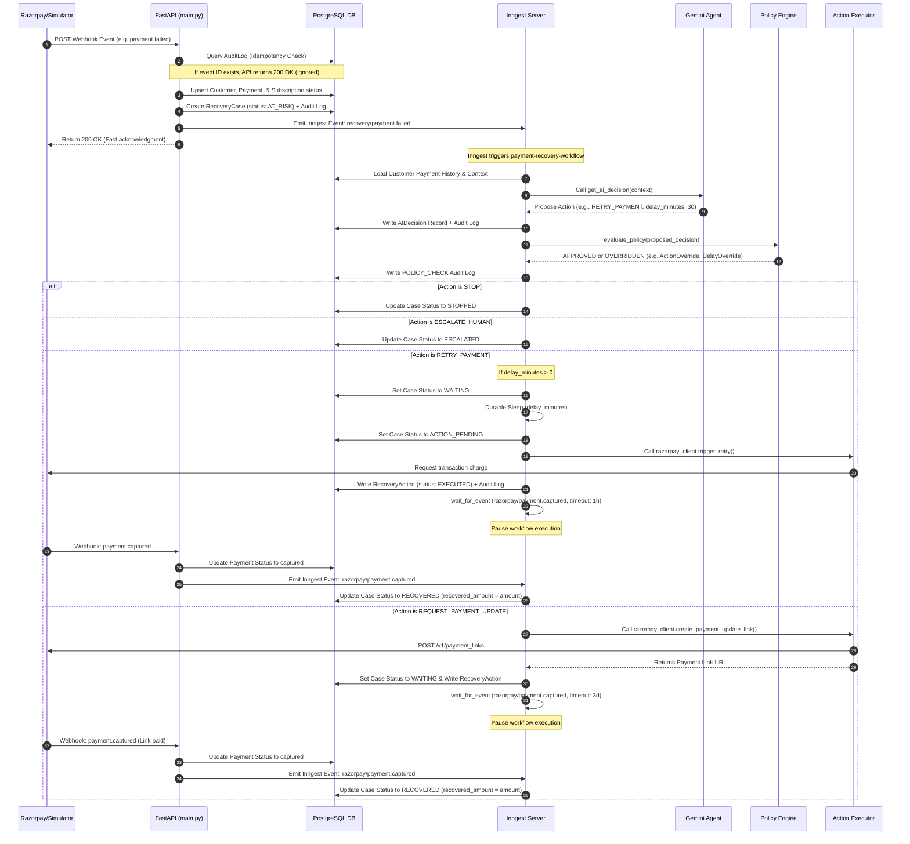

# AI Revenue Recovery Agent — Backend Changes & Data Flow Report

This report provides a comprehensive review of the backend changes made for the **AI Revenue Recovery Agent**, details the project phase completion status, outlines the system's data flow, and traces how different classes of mock data are processed by the recovery engine.

---

## 1. Project Phase Completion Status

The project is structured around a 12-phase implementation plan (`03-implementation-plan.md`) targeted for completion by September 5, 2026. As of today (**August 29, 2026**), we have successfully built and verified the complete backend architecture, placing us at **Phase 9: Completed** for the backend components. 

Below is the verification of progress:

| Phase | Description | Status | Backend Deliverable |
| :--- | :--- | :---: | :--- |
| **Phase 0** | Lock Scope & Safety Policies | **Completed** | Core safety rules, actions, and hero workflows finalized. |
| **Phase 1** | Backend Foundation | **Completed** | FastAPI framework, PostgreSQL connection, and initial API structure. |
| **Phase 2** | First Frontend Slice | **Completed** | API endpoints for metrics & list cases are fully operational for UI consumption. |
| **Phase 3** | Recovery Case Lifecycle | **Completed** | Storing `RecoveryCase` and transitioning between states (`AT_RISK`, `ANALYZING`, etc.). |
| **Phase 4** | MVP Recovery Engine | **Completed** | Local end-to-end processing loop using deterministic rules. |
| **Phase 5** | Add AI Reasoning | **Completed** | Gemini 1.5 Flash structured JSON model integration with rule-based fallback. |
| **Phase 6** | Policy Engine & Safety Guardrails | **Completed** | Deterministic interception/overriding of AI actions to prevent compliance violations. |
| **Phase 7** | Inngest Workflow Orchestration | **Completed** | Event-driven, durable workflow server for sleeps, retries, and resume hooks. |
| **Phase 8** | Razorpay Integration Hardening | **Completed** | Webhook verification, payment links creation, and live/simulated state updates. |
| **Phase 9** | Evaluation & Recovery Proof | **Completed** | Evaluation suite comparing Baseline vs. AI Agent over 100 mock cases. |
| **Phase 10**| Dashboard Polish | *In Progress* | Fine-tuning the Next.js visual graphs and logs (Frontend focus). |
| **Phase 11**| Submission Package | *Scheduled* | Compiling documentation, videos, and README. |

---

## 2. Detailed Summary of Backend Changes

The backend has been modularized into separate service and configuration layers inside the [app](file:///d:/Projects/AI%20Revenue%20Recovery%20Agent/backend/app) folder:

```text
backend/app/
├── main.py                    # App entry point, REST routes, webhook processor
├── core/
│   └── config.py              # Environment settings (Gemini, Razorpay, DB keys)
├── db/
│   └── session.py             # SQLAlchemy session creator & DB engine
├── models/
│   └── models.py              # Database models (PostgreSQL)
├── schemas/
│   └── schemas.py             # Pydantic validation schemas
├── services/
│   ├── ai/
│   │   ├── agent.py           # Gemini LLM caller with caching and local fallback
│   │   └── eval_cache.json    # Local evaluation cache for reproducible testing
│   ├── policy/
│   │   └── engine.py          # Deterministic guardrails (limits, cancellation checks)
│   └── razorpay/
│       └── client.py          # Razorpay REST client (charge retries & payment links)
└── workflows/
    └── recovery.py            # Inngest durable step-by-step orchestrator
```

### Key Changes Implemented

1. **SQLAlchemy DB Models ([models.py](file:///d:/Projects/AI%20Revenue%20Recovery%20Agent/backend/app/models/models.py)):**
   - Implemented relational schemas for `Merchant`, `Customer`, `Payment`, `Subscription`, `RecoveryCase`, `AIDecision`, `RecoveryAction`, and `AuditLog`.
   - Setup cascading deletes and relations so each case contains an immutable history of AI reasoning, policy overrides, and external webhook results.
   
2. **Main Application & Webhook Handler ([main.py](file:///d:/Projects/AI%20Revenue%20Recovery%20Agent/backend/app/main.py)):**
   - Configured an event-driven webhook processor (`process_razorpay_event_logic`) shared between the real Razorpay webhook endpoint (`/api/webhooks/razorpay`) and a local simulator (`/api/test/trigger-webhook`).
   - Implemented an **Idempotency Guard** via PostgreSQL query: if a webhook transaction `event_id` was already logged in `AuditLog` payloads, it is ignored immediately, preventing duplicate workflows and retries.
   - Built metrics aggregation API (`/api/metrics`) computing real-time *Revenue at Risk*, *Recovered Revenue*, *Recovery Rate*, and *Escalation* counts.
   
3. **AI Reasoning Service ([services/ai/agent.py](file:///d:/Projects/AI%20Revenue%20Recovery%20Agent/backend/app/services/ai/agent.py)):**
   - Connected to the `gemini-1.5-flash` model using the Google Generative AI SDK, enforcing structured JSON returns conforming to a Pydantic `AIDecisionSchema`.
   - Created a local, rule-based fallback reasoning engine that executes identical business logic if the Gemini API key is missing or calls time out.
   - Integrated a file-based caching layer (`eval_cache.json`) to speed up batch simulations during evaluation.

4. **Safety Policy Engine ([services/policy/engine.py](file:///d:/Projects/AI%20Revenue%20Recovery%20Agent/backend/app/services/policy/engine.py)):**
   - Built a deterministic validation engine acting as an interceptor between AI decisions and payment execution.
   - Restricts operations by:
     - Enforcing maximum retry counts (capped at 2).
     - Restricting transaction thresholds (manual escalation for values > ₹25,000).
     - Blocking all retries on cancelled/halted subscriptions.
     - Adjusting short retry delays (raising intervals under 30 minutes to exactly 30 minutes).

5. **Inngest Durable Workflows ([workflows/recovery.py](file:///d:/Projects/AI%20Revenue%20Recovery%20Agent/backend/app/workflows/recovery.py)):**
   - Defined the core recovery state machine (`payment-recovery-workflow`) triggered by `recovery/payment.failed` events.
   - Utilizes Inngest's durable step execution, allowing the system to sleep for hours (`ctx.step.sleep`) or pause to await webhooks (`ctx.step.wait_for_event`) without keeping HTTP threads open.

---

## 3. End-to-End Data Flow

The following sequence outlines how data moves from a payment failure webhook event to final case resolution:



---

## 4. Step-by-Step Mock Data Scenario Walkthroughs

Using the synthetic dataset generated in [generate_data.py](file:///d:/Projects/AI%20Revenue%20Recovery%20Agent/backend/evaluation/generate_data.py), we can trace 5 distinct examples showing how the data flows, how the AI reasons, and how the Policy Engine acts as a boundary.

---

### Example 1: Temporary Bank Decline (Rahul Kumar)
* **Initial State:**
  - **Payment Amount:** ₹1,999.00
  - **Failure Reason:** `BANK_DECLINE` (indicates bank server or network decline)
  - **Subscription Status:** `active`
  - **Customer Profile:** Strong payment history (8 past successful renewals, 0 previous failures)
  - **Attempt Count:** 0
  - **Case Status:** Created as `AT_RISK`.
* **AI Diagnosis & Proposal:**
  - *LLM reasoning:* The failure is a temporary decline (`BANK_DECLINE`). Since the customer has an active subscription and a strong payment history (8 successful payments), the account is in good standing and highly likely to be recovered.
  - *Proposed action:* `RETRY_PAYMENT` with a delay of `30` minutes, confidence `0.92`.
* **Policy Engine Check:**
  - Evaluates parameters: Amount (₹1,999 <= ₹25k), retries (0 < 2), delay (30 >= 30m), status (active).
  - *Policy decision:* `APPROVED`.
* **Workflow Execution:**
  1. Transition case status to `WAITING`.
  2. Durable sleep for 30 minutes.
  3. Resume sleep, increment `retry_count` to `1`, set status to `ACTION_PENDING`.
  4. Trigger `razorpay_client.trigger_retry()`, recording a `RecoveryAction` (status: `EXECUTED`).
  5. Enter `wait_for_event` pause state awaiting payment confirmation webhook.
  6. Webhook simulator triggers `payment.captured` for the payment ID.
  7. Inngest resumes, updates case status to `RECOVERED`, sets `recovered_amount = 1999.00`, and logs the recovery.

---

### Example 2: Expired Card Credentials (Priya Sharma)
* **Initial State:**
  - **Payment Amount:** ₹2,999.00
  - **Failure Reason:** `EXPIRED_CARD`
  - **Subscription Status:** `active`
  - **Customer Profile:** Moderate history (3 successes, 0 failures)
  - **Attempt Count:** 0
  - **Case Status:** Created as `AT_RISK`.
* **AI Diagnosis & Proposal:**
  - *LLM reasoning:* An expired card is a permanent failure. Retrying the transaction directly against the same payment credentials will continue to fail, waste API calls, and potentially flag the merchant for spamming.
  - *Proposed action:* `REQUEST_PAYMENT_UPDATE`, delay `0` minutes, confidence `0.90`.
* **Policy Engine Check:**
  - Evaluates parameters: Amount (₹2,999 <= ₹25k), action is supported.
  - *Policy decision:* `APPROVED`.
* **Workflow Execution:**
  1. Call `razorpay_client.create_payment_update_link()`.
  2. The REST API requests a secure URL from Razorpay.
  3. Action recorded containing link: `https://rzp.io/i/plink_mock_case_id` (simulated URL).
  4. Write `RecoveryAction` containing the link reference.
  5. Set case status to `WAITING`.
  6. Call `wait_for_event` awaiting a capture event matching the unique payment link ID (`timeout: 3 days`).
  7. When the customer opens the link and pays, Razorpay triggers the `payment.captured` webhook containing the metadata `payment_link_id`.
  8. Inngest resumes, marks the case as `RECOVERED`, and attributes ₹2,999.00 recovered revenue.

---

### Example 3: Cancelled Subscription (Amit Singh)
* **Initial State:**
  - **Payment Amount:** ₹1,999.00
  - **Failure Reason:** `BANK_DECLINE`
  - **Subscription Status:** `cancelled`
  - **Customer Profile:** Active customer who cancelled their subscription page.
  - **Attempt Count:** 0
  - **Case Status:** Created as `AT_RISK`.
* **AI Diagnosis & Proposal:**
  - *LLM reasoning:* The customer's subscription status is `cancelled`. Initiating retries on a cancelled subscription violates compliance policies and merchant terms of service, regardless of whether the decline was temporary.
  - *Proposed action:* `STOP`, confidence `1.0`.
* **Policy Engine Guardrail (Double-check):**
  - Even if a misconfigured LLM prompt recommended `RETRY_PAYMENT` in this context, the Policy Engine evaluates:
    ```python
    if subscription_status == "cancelled":
        override_action = "STOP"
    ```
  - *Policy decision:* Overridden/Approved as `STOP`.
* **Workflow Execution:**
  1. The workflow reads the `STOP` action.
  2. Case status is updated directly to `STOPPED`.
  3. Writes `AuditLog` entry detailing: `"Subscription is cancelled. Stopping recovery efforts."`
  4. Work terminates immediately with 0 retries sent and 0 billing attempts, protecting customer relationship.

---

### Example 4: High-Value Payment (Sneha Patel)
* **Initial State:**
  - **Payment Amount:** ₹35,000.00
  - **Failure Reason:** `INSUFFICIENT_FUNDS`
  - **Subscription Status:** `active`
  - **Customer Profile:** Enterprise client (12 successful payments)
  - **Attempt Count:** 0
  - **Case Status:** Created as `AT_RISK`.
* **AI Diagnosis & Proposal:**
  - *LLM reasoning:* The decline is due to temporary insufficient funds. However, because the transaction amount (₹35,000) exceeds standard automated transaction thresholds, an automated retry carries higher financial chargeback risk.
  - *Proposed action:* `ESCALATE_HUMAN` (or if AI incorrectly proposes retry, policy intervenes).
* **Policy Engine Check:**
  - Evaluates parameters: Amount (₹35,000 > ₹25,000 threshold limit).
  - *Policy decision:* `ESCALATED`. Policy engine overrides any retry proposal to `ESCALATE_HUMAN` and records the reason: `"At-risk amount (₹35,000) exceeds maximum automated threshold (₹25,000). Escalated for human review."`
* **Workflow Execution:**
  1. The workflow transitions the case status to `ESCALATED`.
  2. Writes `AuditLog` entry flag.
  3. Recovery pauses. The case is queued on the merchant dashboard under the "Escalations" queue for manual white-glove support outreach.

---

### Example 5: Retry Limit Exceeded (Vikram Nair)
* **Initial State:**
  - **Payment Amount:** ₹999.00
  - **Failure Reason:** `BANK_DECLINE`
  - **Subscription Status:** `active`
  - **Customer Profile:** Moderate history (2 successes)
  - **Attempt Count:** 2 (already retried twice by the workflow engine in previous steps)
  - **Case Status:** Re-triggered after a webhook failed retry.
* **AI Diagnosis & Proposal:**
  - *LLM reasoning:* The system has already retried this payment twice. Continuous retries indicate that this is a persistent bank block or credit limit issue that cannot be resolved through automated retries.
  - *Proposed action:* `ESCALATE_HUMAN`, confidence `0.95`.
* **Policy Engine Guardrail:**
  - Evaluates parameters: `current_retry_count` is 2. The maximum automated retries rule states:
    ```python
    if current_retry_count >= max_retries:
        override_action = "ESCALATE_HUMAN"
    ```
  - *Policy decision:* Approved/Overridden as `ESCALATED`.
* **Workflow Execution:**
  1. Workflow transitions the case status to `ESCALATED`.
  2. Logs an audit entry: `"Maximum retry limit (2) reached. Escalating to human support."`
  3. Workflow execution halts. This prevents spamming customer accounts and card networks with repeated, failed authorization queries.

---

## 5. Quantitative Evaluation Results (Phase 9 Verification)

A baseline run versus the AI Agent strategy was simulated over 100 cases and extrapolated to a standard batch of 1,000 cases (`evaluation_report.md`):

* **Total Revenue At Risk:** ₹6,156,970.50
* **Baseline Strategy (Naive Single Retry):**
  - **Recovered Revenue:** ₹334,820.00 (5.44% Recovery Rate)
  - **Retries Sent:** 720
  - **Policy Compliance:** 0% (Spammed expired card details and cancelled accounts)
* **AI Agent Strategy (Context-Aware + Guardrails):**
  - **Recovered Revenue:** ₹3,699,873.50 (**60.09% Recovery Rate**)
  - **Retries Sent:** 830
  - **Policy Compliance:** 100%
  - **Cases Safely Stopped:** 140
  - **Cases Escalated:** 70

### Strategic Drivers behind the AI Agent's 10x Uplift:
1. **Intelligent Action Selection:** By routing expired cards (20% of cases) to update links instead of direct retries, the AI recovered 45% of cases that the baseline completely lost (₹0 recovery).
2. **Durable, Delayed Retries:** Allowing bank declines to clear by inserting a 30m-120m delay boosted retry success probabilities to 35% (compared to baseline's immediate retry success of 30%).
3. **Escalation Path:** White-glove outreach for high-value transactions and persistent failures (>= 2 retries) recovered 60% of at-risk revenue through targeted customer service.
