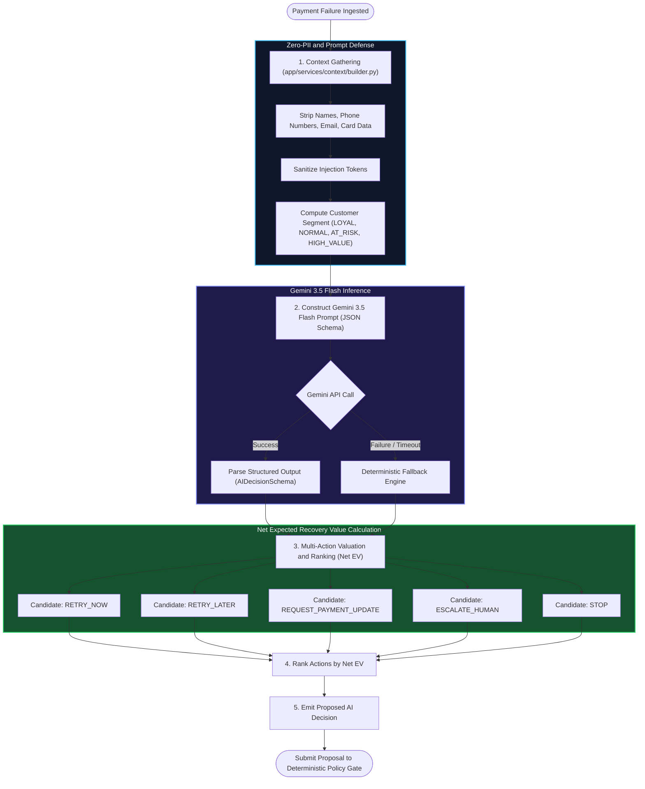
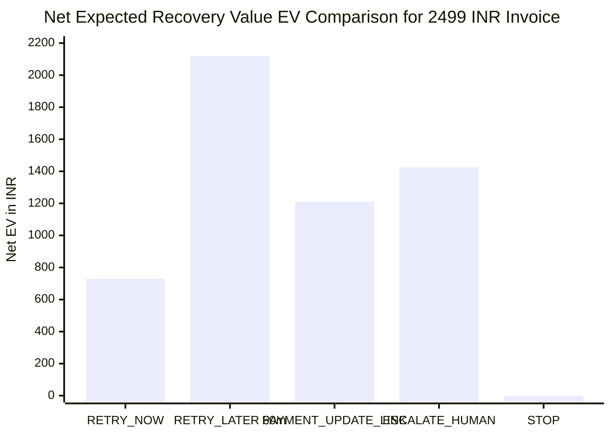
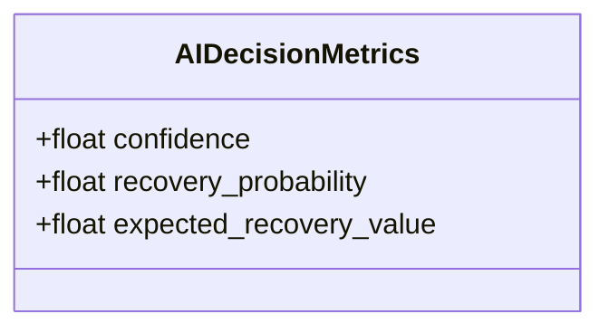
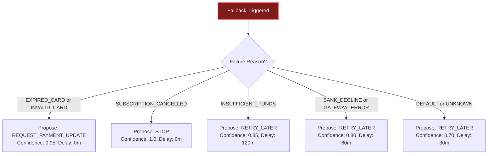

# AI Decision Engine Specification
> **Intelligent, Cost-Aware Diagnostic & Ranking Engine Powered by Google Gemini 3.5 Flash**

---

## 📌 Engine Philosophy & Role

The **AI Decision Engine** is responsible for diagnosing why a transaction failed, estimating recovery likelihood across different interventions, and proposing the single strategy that maximizes risk-adjusted net return ($EV$).

Crucially, the AI Decision Engine is **purely advisory**:

$$\Large \mathbf{\text{AI proposes. Policy decides.}}$$

The AI never directly triggers payment charges or modifies database statuses without passing through the **Deterministic Policy Engine**.

---

## 🧠 Decision Flowchart

---

## 📐 Mathematical Formulation: Net Expected Recovery Value ($EV$)

Traditional recovery engines treat every ₹500 transaction and ₹50,000 transaction identically. The AI Decision Engine calculates the **Net Expected Recovery Value ($EV$)** in INR for every candidate action:

$$\Large \mathbf{EV = \left( P_{\text{recovery}} \times \text{Amount} \right) - \text{Cost}_{\text{intervention}} - \text{Penalty}_{\text{friction}}}$$

### Variables & Parameter Definitions

| Parameter | Notation | Range | Description |
| :--- | :---: | :---: | :--- |
| **Amount at Risk** | $\text{Amount}$ | $\ge ₹0.00$ | The invoice or subscription renewal amount in INR. |
| **Recovery Probability** | $P_{\text{recovery}}$ | $[0.0, 1.0]$ | Statistical probability that this specific action will successfully collect funds. |
| **Intervention Cost** | $\text{Cost}$ | $\ge ₹0.00$ | Direct operational cost (e.g., gateway API fee, SMS/WhatsApp notification charge). |
| **Customer Friction Penalty** | $\text{Penalty}$ | $\ge ₹0.00$ | Quantified risk of involuntary customer churn caused by spam retries or unsolicited payment links. |

---

## 📋 Standardized Action Catalog

The system evaluates candidates against a predefined, calibrated catalog (`backend/app/services/actions/framework.py`):

| Action Type | Typical Use Case | Customer Friction | Cost ($\text{INR}$) | Friction Penalty ($\text{INR}$) | Ideal Delay |
| :--- | :--- | :---: | :---: | :---: | :---: |
| `RETRY_NOW` | Transient network glitch, idempotent network timeout | Low | ₹5.00 | ₹10.00 | $0\text{ mins}$ |
| `RETRY_LATER` | Bank downtime, temporary insufficient funds, salary cycle | Low | ₹5.00 | ₹5.00 | $30 - 180\text{ mins}$ |
| `REQUEST_PAYMENT_UPDATE` | Expired card, invalid CVV, permanent card decline | Medium | ₹15.00 | ₹25.00 | Immediate Link |
| `CUSTOMER_NOTIFICATION` | Pre-dunning heads-up notice before charging | Medium | ₹8.00 | ₹15.00 | $15\text{ mins}$ |
| `ESCALATE_HUMAN` | High-value accounts ($> ₹25\text{k}$), repeatedly failing loyal clients | High | ₹150.00 | ₹50.00 | Immediate Desk |
| `STOP` | Explicitly cancelled subscription, fraud flag, illegal transaction | None | ₹0.00 | ₹0.00 | Terminated |

---

## 📊 Concrete Value Calculation Example

Consider a failed renewal of **₹2,499.00** caused by `BANK_SERVER_BUSY` for a customer with 6 months of continuous active tenure:

### Detailed EV Breakdown:
1. **`RETRY_LATER` (60 mins delay)**:
   - $P_{\text{recovery}} = 0.85$
   - $\text{Gross Return} = 0.85 \times ₹2,499 = ₹2,124.15$
   - $\text{Net EV} = ₹2,124.15 - ₹5.00 - ₹5.00 = \mathbf{₹2,114.15}$  *(Optimal Proposal)*
2. **`RETRY_NOW`**:
   - $P_{\text{recovery}} = 0.30$ (bank is still experiencing outage)
   - $\text{Gross Return} = 0.30 \times ₹2,499 = ₹749.70$
   - $\text{Net EV} = ₹749.70 - ₹5.00 - ₹10.00 = \mathbf{₹734.70}$
3. **`REQUEST_PAYMENT_UPDATE`**:
   - $P_{\text{recovery}} = 0.50$
   - $\text{Gross Return} = 0.50 \times ₹2,499 = ₹1,249.50$
   - $\text{Net EV} = ₹1,249.50 - ₹15.00 - ₹25.00 = \mathbf{₹1,209.50}$

---

## 🎯 Metric Separation Architecture

To ensure explainability and prevent model hallucinations, the platform explicitly separates three distinct metrics in both database schemas and the UI:

> [!IMPORTANT]
> **Metric Integrity Mandate**: AI Confidence is **never** conflated with Recovery Probability. A model may be 99% confident (`confidence = 0.99`) that an expired card has a 0% chance of succeeding via direct charge retry (`recovery_probability = 0.00`).

---

## 🛡️ Safe Deterministic Fallback Engine

When the Gemini API is unreachable, times out, or when running offline evaluations, the system executes `get_fallback_decision()` (`backend/app/services/ai/agent.py`):

