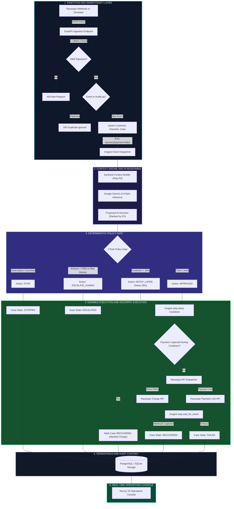
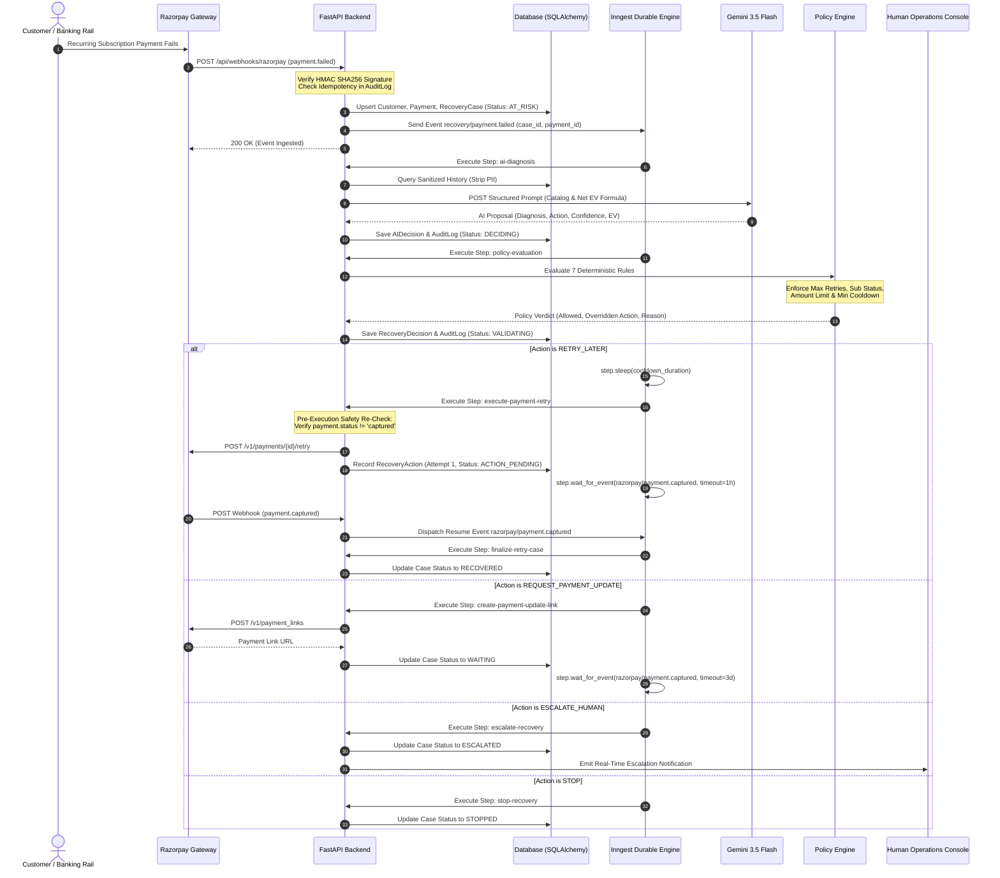
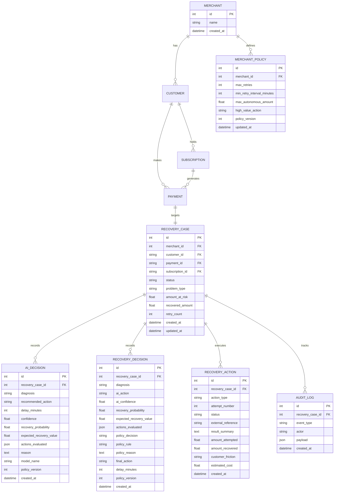

# System Architecture — Autonomous AI Revenue Recovery Agent
> **Razorpay AI Buildathon 2026 — Track 3 Submission**  
> *Production-Grade, Event-Driven Autonomous Revenue Recovery Platform with Deterministic Safety Gates.*

---

## 📌 Architectural Overview

The **Autonomous AI Revenue Recovery Agent** is designed for high-volume subscription businesses and digital merchants operating on Razorpay. It replaces naive, indiscriminate cron retries with an intelligent, context-aware recovery lifecycle governed by the foundational principle:

$$\Large \mathbf{\text{AI proposes. Policy decides.}}$$

The platform harmonizes four architectural pillars:
1. **Event Ingestion & Idempotency Layer (FastAPI)**: Ingests webhooks with HMAC SHA256 signature verification and atomic database deduplication.
2. **Context Engine & AI Decision Engine (Google Gemini 3.5 Flash)**: Synthesizes sanitized, zero-PII transaction history and ranks candidate recovery strategies by Net Expected Recovery Value ($EV$).
3. **Deterministic Policy Gate**: An independent non-LLM rule engine evaluating 7 strict safety guardrails.
4. **Durable Execution & Orchestration Engine (Inngest)**: Multi-step durable workflows handling scheduled delays, retry pre-checks, API execution, and asynchronous webhook resume listening.

---

## 🏛️ End-to-End System Architecture

---

## 🔄 Sequence Diagram: End-to-End Recovery Flow

---

## 🧩 Component Breakdown

### 1. Ingestion & Idempotency Layer (`backend/app/main.py`)
- **HMAC Signature Guard**: Computes `hmac.new(secret, body, sha256)` against `X-Razorpay-Signature`. Rejecting unauthenticated requests prevents malicious spoofing.
- **Atomic Idempotency Guard**: Checks if incoming `event_id` exists in `AuditLog.payload["event_id"]`. Duplicates return HTTP 200 immediately without redundant processing.
- **Relational Upserting**: Idempotently creates or syncs `Merchant`, `Customer`, `Subscription`, `Payment`, and `RecoveryCase` records.

### 2. Context Engine (`backend/app/services/context/builder.py`)
- **Zero-PII Sanitation**: Explicitly removes customer names, email addresses, phone numbers, and full card details.
- **Prompt Injection Defense**: Sanitizes tokens such as `[INST]`, `<|im_start|>`, `ignore previous instructions`, `system prompt`, and caps payload length to 500 characters.
- **Heuristic Customer Segmentation**: Categorizes customer risk based on longevity, successful renewal track record, and payment failure frequency (`LOYAL`, `NORMAL`, `AT_RISK`, `HIGH_VALUE`).

### 3. AI Decision Engine (`backend/app/services/ai/agent.py`)
- **Gemini 3.5 Flash Reasoning**: Invoked with structured Pydantic schema enforcement via JSON schema mode.
- **Multi-Action Candidate Ranking**: Evaluates the action catalog (`RETRY_NOW`, `RETRY_LATER`, `REQUEST_PAYMENT_UPDATE`, `CUSTOMER_NOTIFICATION`, `ESCALATE_HUMAN`, `STOP`) and computes the Net Expected Recovery Value ($EV$) for each candidate.
- **Metric Separation**: Strict architectural separation between **Confidence** ($0.0 - 1.0$), **Recovery Probability** ($0.0 - 1.0$), and **Expected Value** (INR).

### 4. Deterministic Policy Gate (`backend/app/services/policy/engine.py`)
- Evaluates a 7-rule sequential cascade. AI proposals that violate merchant boundaries are immediately overridden.
- Tracks `policy_version` on every decision for tamper-proof regulatory auditability.

### 5. Durable Orchestration Engine (`backend/app/workflows/recovery.py`)
- Built on **Inngest Python SDK v0.3.0+**.
- Uses durable primitives:
  - `step.run(step_id, handler)` for non-blocking atomic execution units.
  - `step.sleep(step_id, duration)` for robust cooldowns lasting minutes to days without consuming server threads.
  - `step.wait_for_event(step_id, event, timeout, if_exp)` for asynchronous webhook synchronization.
- **Pre-Execution Safety Re-Check**: Before dispatching any payment retry, the database and payment status are re-verified to prevent double-charging if the customer paid during the cooldown sleep.

---

## 📊 Data Model & Entity-Relationship Diagram

