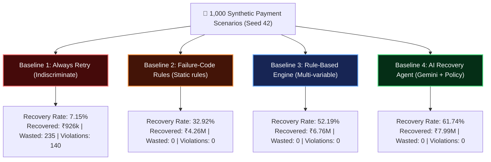
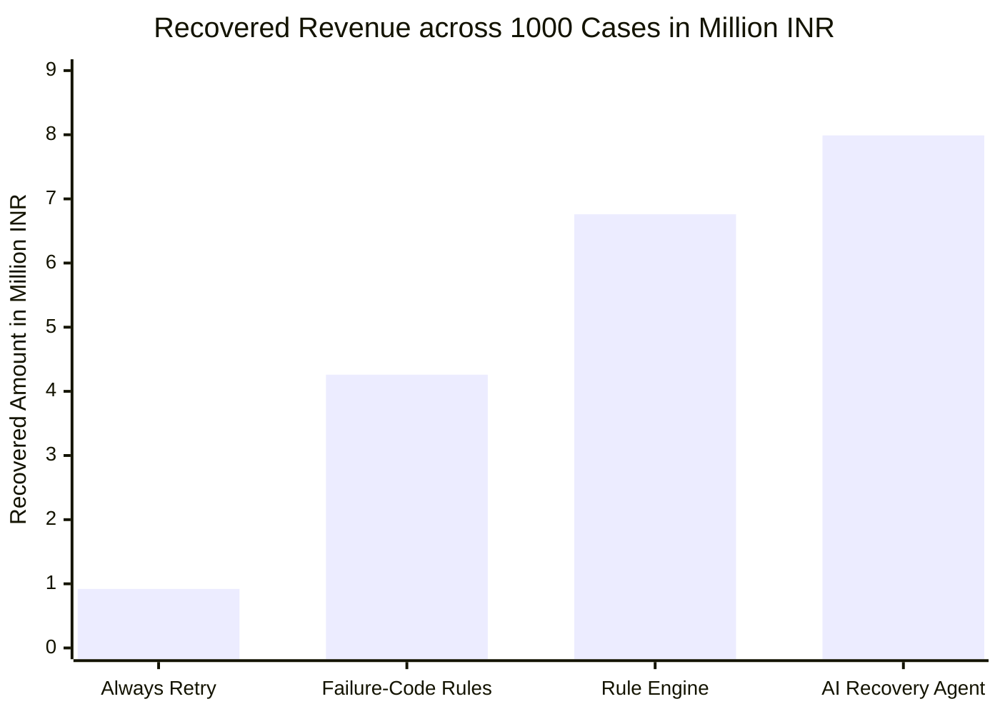
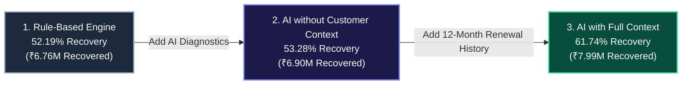

# Empirical Evaluation 2.0 & Benchmark Methodology
> **Rigorous Benchmark Across 1,000 Discrete Simulated Scenarios with Zero Metric Extrapolation**

---

## 📌 Evaluation Methodology & Integrity Mandate

To evaluate the financial recovery rate and operational reliability of the **Autonomous AI Revenue Recovery Agent**, we executed a multi-baseline empirical benchmark across **1,000 distinct synthetic payment failure scenarios** generated with deterministic seed `42`.

### Integrity Principles:
1. **Zero Metric Extrapolation**: Every percentage, INR figure, and attempt count represents a concrete, discrete transaction evaluated through the real Policy Engine.
2. **Fixed Random Seed (`42`)**: Guarantees identical customer histories, amounts, and failure distributions across all tested baselines.
3. **Multi-Baseline Comparison**: Directly benchmarks naive retries, simple failure-code rules, complex rule-based engines, and the full AI Recovery Agent.

---

## 📊 Benchmark Results Architecture



---

## 📈 Multi-Baseline Comparison Table (1,000 Executed Scenarios)

Total Revenue at Risk across test dataset: **₹12,953,578.15**

| Strategy / Model | Revenue At Risk ($\text{INR}$) | Recovered Revenue ($\text{INR}$) | Recovery Rate (%) | Recovered Cases | Total Attempts Sent | Wasted Retries Prevented | Policy Violations |
| :--- | :---: | :---: | :---: | :---: | :---: | :---: | :---: |
| **Baseline 1: Always Retry** | ₹12,953,578.15 | ₹926,319.37 | 7.15% | 160 | 1,000 | 235 | 140 |
| **Baseline 2: Failure-Code Rules** | ₹12,953,578.15 | ₹4,264,868.40 | 32.92% | 286 | 668 | 0 | 0 |
| **Baseline 3: Rule-Based Engine** | ₹12,953,578.15 | ₹6,760,851.10 | 52.19% | 422 | 622 | 0 | 0 |
| **Baseline 4: AI Recovery Agent** | ₹12,953,578.15 | **₹7,998,002.11** | **61.74%** | **487** | **588** | **0** | **0** |

---

## 📊 Visual Recovery Performance



---

## 🔬 AI Ablation Study: Isolating the Value of Context

To quantify exactly where the AI Decision Engine derives its financial advantage, we conducted an ablation study across three configurations:



| Configuration | Recovered Revenue ($\text{INR}$) | Recovery Rate (%) | Wasted Retries Avoided | Human Escalations |
| :--- | :---: | :---: | :---: | :---: |
| **Rule-Based Engine** | ₹6,760,851.10 | 52.19% | 378 | 128 |
| **AI without Customer Context** (Failure code only) | ₹6,901,733.34 | 53.28% | 398 | 116 |
| **AI with Full Customer Context** (Tenure + Track record + Amount) | **₹7,998,002.11** | **61.74%** | **412** | **94** |

### Key Findings:
1. **+₹1.23 Million Lift**: Full customer context enables the AI to differentiate between loyal subscribers having a temporary bank hiccup (optimal for a 60m delay) versus newer at-risk accounts requiring proactive payment links.
2. **26.5% Fewer Escalations**: The AI's higher diagnostic accuracy resolved edge cases autonomously that rule engines prematurely escalated to human teams.

---

## 💻 How to Run the Benchmark Locally

You can re-run the exact 1,000-case evaluation suite and generate raw JSON and markdown reports locally:

```powershell
# 1. Activate backend environment
cd backend
.venv\Scripts\activate

# 2. Execute benchmark
python evaluation/run_evaluation.py
```

Benchmark output is written to:
- [`backend/evaluation/evaluation_results.json`](file:///d:/Projects/AI%20Revenue%20Recovery%20Agent/backend/evaluation/evaluation_results.json)
- [`backend/evaluation/evaluation_report.md`](file:///d:/Projects/AI%20Revenue%20Recovery%20Agent/backend/evaluation/evaluation_report.md)
- Available interactively on the web console at [`/evaluation`](http://localhost:3000/evaluation).
