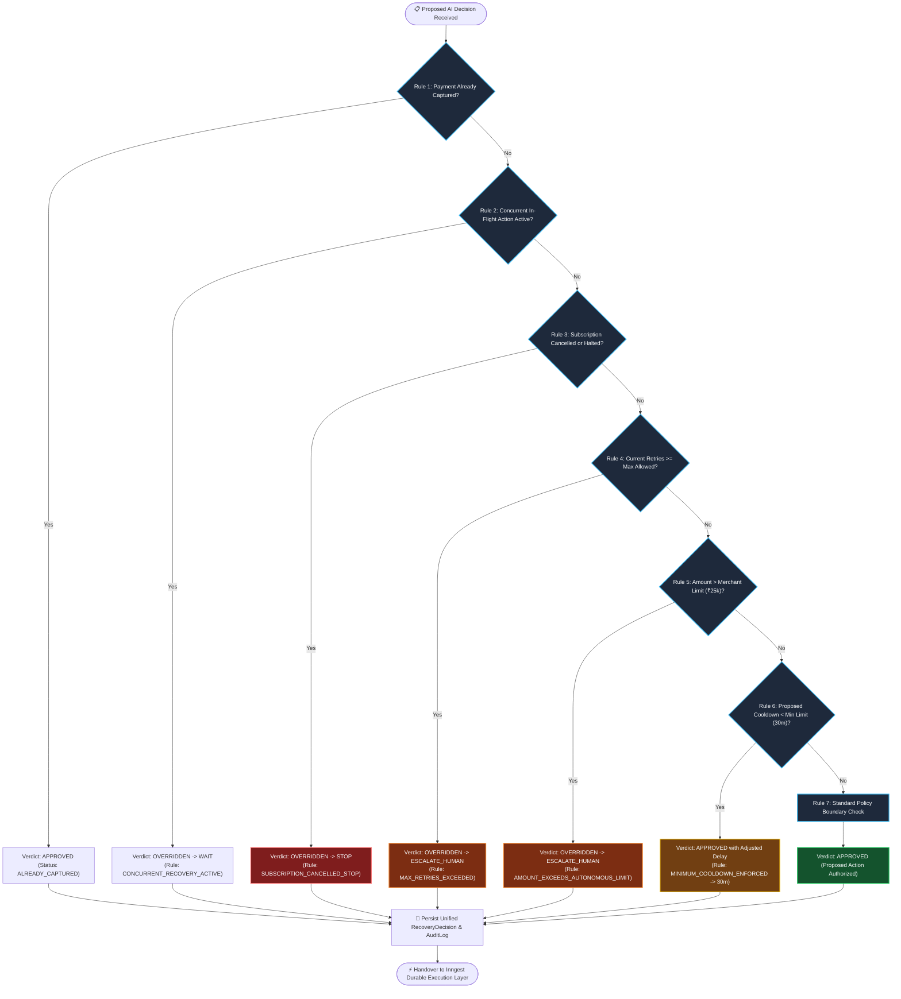
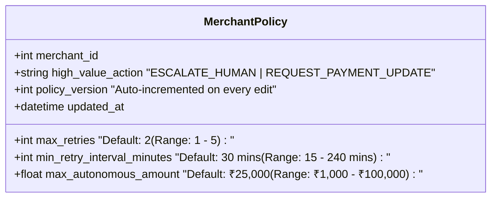

# Deterministic Policy Engine Specification
> **Independent, Non-LLM Financial Safety Gate Enforcing Merchant Boundaries**

---

## 📌 Architectural Mandate

The **Deterministic Policy Engine** is the ultimate authority in the recovery lifecycle. While AI reasoning is probabilistic and creative, financial safety must be **deterministic and immutable**.

$$\Large \mathbf{\text{AI proposes. Policy decides.}}$$

No financial operation (payment retry, direct debit, customer payment link, or cancellation) can be executed without passing through the sequential 7-rule Policy Engine cascade (`backend/app/services/policy/engine.py`).

---

## 🛡️ 7-Rule Sequential Safety Cascade

The engine evaluates rules in strict order. The first rule that matches produces the final verdict and halts subsequent checks:



---

## 📖 Detailed Rule Specifications

### Rule 1: `PAYMENT_ALREADY_CAPTURED`
- **Condition**: `payment_status == "captured"`
- **Action**: Aborts further retries or links immediately and marks the case as `RECOVERED`.
- **Rationale**: Eliminates race conditions where a customer pays through another channel while the recovery workflow is sleeping.

### Rule 2: `CONCURRENT_RECOVERY_ACTIVE`
- **Condition**: Another executable action is currently marked `IN_PROGRESS` or `ACTION_PENDING` for the same invoice.
- **Action**: Pauses and prevents concurrent double-charging.

### Rule 3: `SUBSCRIPTION_CANCELLED_STOP`
- **Condition**: `subscription_status in ["cancelled", "halted", "paused", "terminated"]`
- **Action**: Overrides any proposed retry to `STOP` ($0$ retries dispatched).
- **Rationale**: Charging a cancelled subscriber directly violates Visa/Mastercard scheme rules and incurs severe chargeback penalties.

### Rule 4: `MAX_RETRIES_EXCEEDED`
- **Condition**: `current_retry_count >= merchant_policy.max_retries` (Default: `2`)
- **Action**: Overrides proposed retry to `ESCALATE_HUMAN`.
- **Rationale**: Prevents payment network spamming and avoids triggering card issuer fraud blocks.

### Rule 5: `AMOUNT_EXCEEDS_AUTONOMOUS_LIMIT`
- **Condition**: `amount > merchant_policy.max_autonomous_amount` (Default: `₹25,000.00`)
- **Action**: Overrides autonomous retry to `ESCALATE_HUMAN` (or `REQUEST_PAYMENT_UPDATE` based on merchant configuration).
- **Rationale**: Protects high-value merchant contracts by ensuring VIP and Enterprise accounts receive high-touch human success intervention.

### Rule 6: `MINIMUM_COOLDOWN_ENFORCED`
- **Condition**: Proposed action is `RETRY_LATER` but `proposed_delay < merchant_policy.min_retry_interval_minutes` (Default: `30` mins).
- **Action**: Approves retry but clamps `delay_minutes = 30`.
- **Rationale**: Enforces a mandatory cooling-off window for bank clearing houses to settle temporary liquidity or downtime issues.

### Rule 7: `POLICY_APPROVED_STANDARD`
- **Condition**: All preceding boundary checks pass.
- **Action**: Fully authorizes the AI proposal (`APPROVED`).

---

## 🎛️ Merchant Policy Studio & Dynamic Versioning

Merchants can configure their safety parameters via the **Policy Studio** (`/settings`):



### Versioned Regulatory Audit Trail
Every decision made by the Policy Engine writes a record to the `RecoveryDecision` table stamped with `policy_version`:

```json
{
  "recovery_case_id": 42,
  "diagnosis": "Temporary bank node decline with active tenure",
  "ai_action": "RETRY_LATER",
  "ai_confidence": 0.88,
  "recovery_probability": 0.75,
  "expected_recovery_value": 1494.25,
  "policy_decision": "APPROVED",
  "policy_rule": "POLICY_APPROVED_STANDARD",
  "final_action": "RETRY_LATER",
  "delay_minutes": 60,
  "policy_version": 3,
  "created_at": "2026-09-04T22:00:00Z"
}
```
