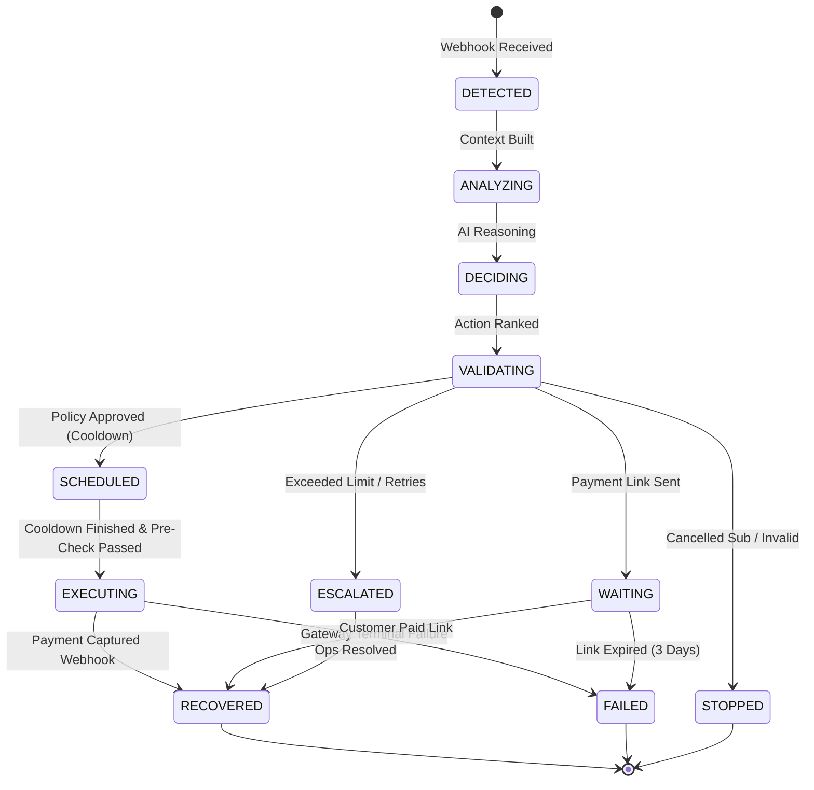

# Recovery Lifecycle & State Machine Specification

The recovery lifecycle models the progression of an at-risk transaction through autonomous diagnosis, policy validation, durable execution, and outcome attribution.

---

## State Transition Diagram



---

## Pre-Execution Safety Re-Check

To eliminate race conditions (e.g. customer paying manually through another channel during the Inngest cooldown sleep), the execution layer executes an immediate database and gateway check:

```python
if payment.status == "captured":
    case.status = "RECOVERED"
    case.recovered_amount = case.amount_at_risk
    return {"aborted": True, "reason": "Payment captured during cooldown window."}
```
