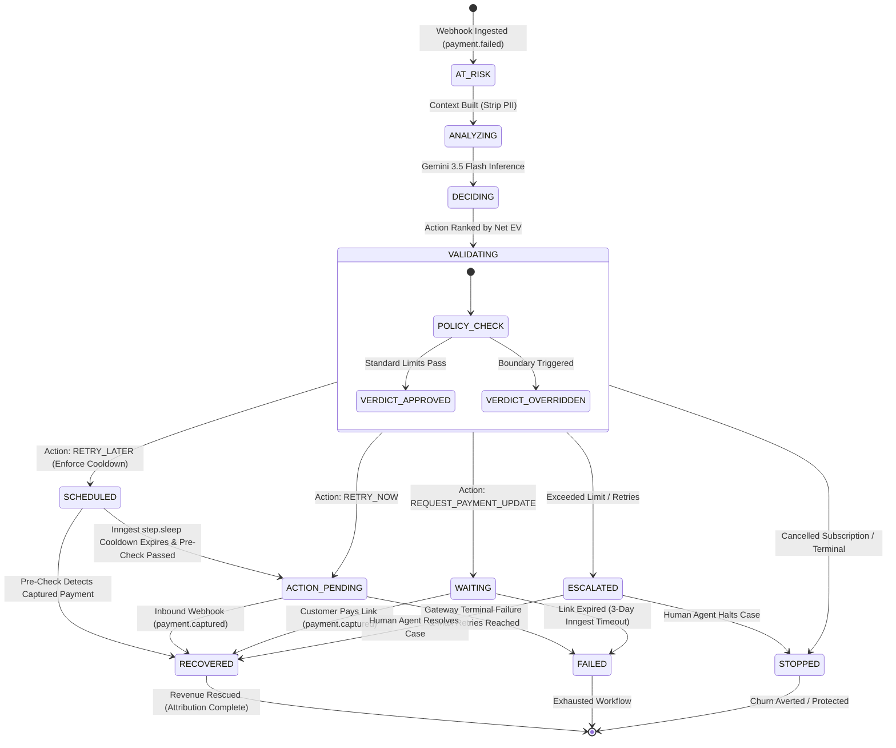
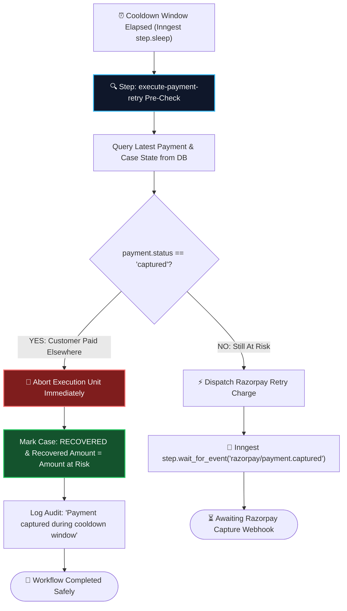

# Recovery Lifecycle & State Machine Specification
> **Durable, Event-Driven Orchestration Lifecycle Governed by Inngest**

---

## 📌 Lifecycle Overview

The recovery lifecycle tracks a failed transaction from the exact moment of inbound Razorpay webhook ingestion through diagnosis, policy arbitration, cooldown management, gateway execution, and revenue attribution.

---

## 🔄 Comprehensive State Machine Diagram

---

## 📋 Complete State Definitions

| State | Description | Typical Duration | Next Possible States |
| :--- | :--- | :---: | :--- |
| `AT_RISK` | Initial failure ingested via webhook; case record created. | $< 1\text{ sec}$ | `ANALYZING` |
| `ANALYZING` | Building sanitized, zero-PII history and customer context. | $< 2\text{ sec}$ | `DECIDING` |
| `DECIDING` | AI Decision Engine calculating Net EV across candidate actions. | $1 - 3\text{ sec}$ | `VALIDATING` |
| `VALIDATING` | Deterministic Policy Gate evaluating 7 safety rules. | $< 100\text{ ms}$ | `SCHEDULED`, `WAITING`, `ACTION_PENDING`, `ESCALATED`, `STOPPED` |
| `SCHEDULED` | Inngest durable sleep active for cooldown interval (e.g., 60 mins). | $30 - 180\text{ mins}$ | `ACTION_PENDING`, `RECOVERED` |
| `WAITING` | Razorpay payment update link generated; awaiting customer payment. | Up to $3\text{ days}$ | `RECOVERED`, `FAILED` |
| `ACTION_PENDING` | Charge retry actively dispatched to Razorpay API; awaiting webhook. | Up to $1\text{ hour}$ | `RECOVERED`, `FAILED` |
| `ESCALATED` | Autonomous boundaries exceeded; routed to Tier-2 operations desk. | Operator-driven | `RECOVERED`, `STOPPED` |
| `STOPPED` | Explicitly halted (e.g. cancelled subscription). Zero spam sent. | Terminal | — |
| `RECOVERED` | Payment captured and verified via webhook; revenue attributed. | Terminal | — |
| `FAILED` | Recovery attempts exhausted without success. | Terminal | — |

---

## 🛡️ Pre-Execution Safety Re-Check (Race-Condition Eliminator)

When an Inngest workflow finishes sleeping (e.g., after a 60-minute cooldown), a race condition could occur if the customer manually logged into the merchant's portal and paid the overdue bill during the sleep window.

To guarantee **zero double-charging**, the execution layer runs an atomic pre-execution check:

---

## ⚡ Inngest Step Mappings

Every state transition maps directly to an Inngest durable primitive in [`backend/app/workflows/recovery.py`](file:///d:/Projects/AI%20Revenue%20Recovery%20Agent/backend/app/workflows/recovery.py):

| Inngest Primitive | Step ID | Workflow Responsibility |
| :--- | :--- | :--- |
| `step.run` | `"ai-diagnosis"` | Sanitizes context and calls Gemini 3.5 Flash JSON schema endpoint. |
| `step.run` | `"policy-evaluation"` | Executes the 7-rule deterministic safety gate cascade. |
| `step.run` | `"stop-recovery"` | Safely terminates workflows for cancelled subscriptions. |
| `step.run` | `"escalate-recovery"` | Routes high-risk or exceeded retry cases to human operations. |
| `step.run` | `"transition-to-scheduled"` | Updates case state to `SCHEDULED` and logs delay parameters. |
| `step.sleep` | `"retry-delay"` | Durable timer suspending workflow execution for `timedelta(minutes=delay)`. |
| `step.run` | `"execute-payment-retry"` | Runs atomic pre-check and triggers Razorpay payment charge. |
| `step.wait_for_event` | `"wait-for-charge-webhook"` | Suspends until `razorpay/payment.captured` event arrives (1h timeout). |
| `step.run` | `"create-payment-update-link"` | Generates customer payment link via Razorpay Links API. |
| `step.wait_for_event` | `"wait-for-customer-payment"` | Suspends until customer completes payment via link (3d timeout). |
| `step.run` | `"finalize-retry-case"` | Updates case to `RECOVERED` or `FAILED` and records attribution audit log. |
